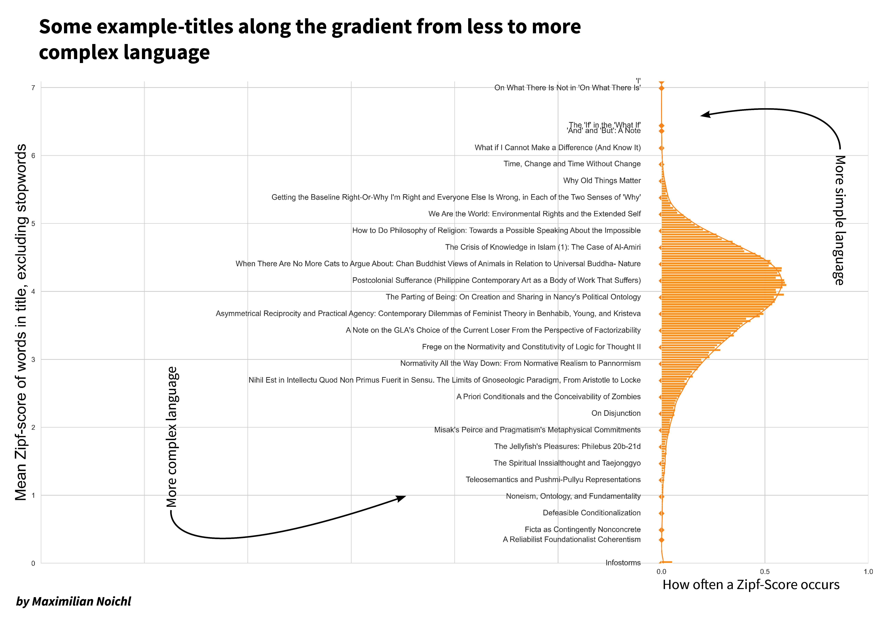
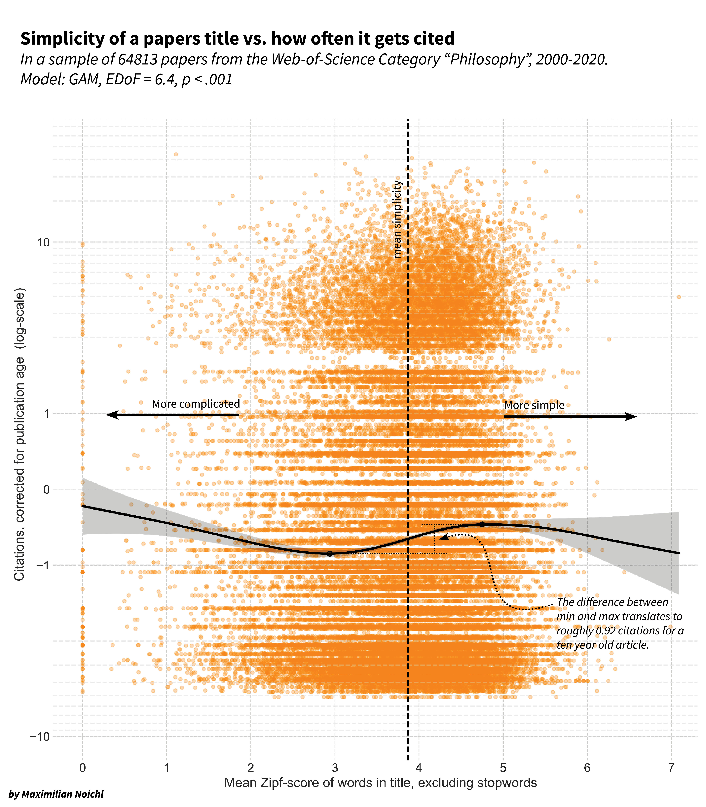

# Philosophy is too complicated! Or: A quick analysis of jargon and citation-rates in philosophy

Justin Weinberg asked a [few days ago](https://dailynous.com/2021/04/15/jargon-citation-in-philosophy/) whether the use of jargon might play into the generally low citation rates of papers in philosophy. I found this question very interesting and decided to turn it into a little weekend project. 

As my sample I used 64813 articles from the Web of Science category 'philosophy'. Further requirements were that they had an abstract associated with them, were published between 2000 and mid-2020, and that the abstract was in English. 

In my investigation, I tried to follow along with the study by Alejandro Martínez and Stefano Mammola (https://royalsocietypublishing.org/doi/10.1098/rspb.2020.2581), which had sparked Justin's earlier investigations. Here a little disclaimer is in order: Some of the approaches were quite new to me, so if anybody would like to check my work, I would appreciate that.

In this study, the authors built a dictionary of jargon from glossaries of encyclopedias relating to cave science. At first, I intended to do something similar using the Stanford Encyclopedia of Philosophy. But it soon became clear that philosophical jargon is just too large and diverse to be coherently captured by a single word-list. 

As an alternative route, I decided to use the word-frequencies in the English language in general as a proxy, with the intuition that more 'jargony' words would nearly always also be quite rare. This is of course a rather broad concept of jargon – it does for example classify some foreign words and names as jargon, which usually isn't what we have in mind. But as less commonly used words are also less broadly known, it does track our intuition that jargon ought to be something that drives a kind of exclusivity.

The frequencies of words were retrieved using the python package `wordfreq` (Speer et al. 2018) in the form of Zipf scores (http://crr.ugent.be/archives/1352). Zipf-scores are the logarithm to the base ten of the number of times a word appears per million words plus 3. So a word with a score of 4 (like "muffin") does appear ten times in a million random words of English, a word with a score of 5 (like "basically") a hundred times. I removed common stopwords (using `nltk`'s list) because they are so frequent that they tend to overpower all other results. 

To get an idea of what this captures, below is a list of sample titles positioned along the distribution of averaged Zipf-scores for them. 

I think it generally fits quite well what we might think of as jargon: Titles like *"Horizonality and Defeasibility"*, *"How To Be A Reliabilist"*, *"Fragmentalist Presentist Perdurantism"*, *"Intrinsicality and Hyperintensionality"* and *"The Parthood of Indiscernibles"*  – to give some further examples – all are classified as rather jargon-heavy, with very low average Zipf-scores, while *"How Bad Can Good People Be?"*, *"Being Right, and Being in the Right"*, *"Could Time be Change?"*, *"How do we know how?"* and *"On what there is (in space)"* receive high Zipf-scores, as they consist mainly of very common words. Most titles of course lie somewhere in the middle between these extremes.

I want also to give some examples from the abstracts in the dataset. Here are two sentences that I took from abstracts that have received low Zipf-scores, as they use rather infrequent words:
* *"This essay argues for a transversal posthumanities-based pedagogy, rooted in an attentive ethico-onto-epistemology, by reading the schizoanalytical praxes of Deleuzoguattarian theory alongside the work of various feminist new materialist scholars."*
* *"In particular, we will argue that Buridan is committed to denying the validity of the Barcan and converse Barcan formulae. We generalize Priestley duality for distributive lattices to a duality for distributive meet-semilattices. On the one hand, our generalized Priestley spaces are easier to work with than Celani's DS-spaces, and are similar to Hansoul's Priestley structures."*

And here are two examples from the opposite end of the distribution, using more common words:

* *"Consider a cat on a mat. On the one hand, there seems to be just one cat, but on the other there seem to be many things with as good a claim as anything in the vicinity to being a cat. Hence, the problem of the many."*
* *"Scientific advances have made the end of life into the primary concern of medicine. But medicine also postpones the end of life, often until the time when we no longer have the mental and physical capacity to deal with it."*

Now I tried to relate these scores to the citation counts of papers. Like Martínez and Mammola I tried to correct for the fact that older papers have more time to accrue citations by relativizing all citation counts to the age of the paper. This is done by fitting a Poisson-model on the citation counts based on the age of the articles. The residuals of this model (how much each papers' citation count deviates from the expected value for a paper of its age) gives us an idea of how highly cited a paper is relative to its cohort, with values above zero denoting that a paper exceeded expectations, and below zero that it belied them.

As it turns out, there is quite some difference between papers with simple and complicated titles. On the x-axis of the following graphic, I show the mean Zipf-score of the articles, on the y-axis the corrected citation-score. To make the trend in the data more obvious, like Martínez and Mammola, I tried to fit a generalized additive model to the data using `pygam`. (This is the first time I tried this, so somebody else should maybe check my work at some point. I suspect that a simpler model together with a bit more principled data-cleaning, might also have sufficed.) 

To figure out how large the difference between the more highly cited articles, which seem to have simpler titles, and the lower cited ones is in absolute numbers, I calculated the difference and plugged that back into the age-correction-model. It seems to translate to 0.59 citations for a five-year-old paper, 0.92 citations after 10 years, or 1.11 citations after 20 years. I think this is quite a lot, as the average 10 y. old paper (authored in 2010) is cited only 6.45 times in total. Please note that all citation counts in my sample are lower than in Justin's original post because I only considered articles published after 2000.

I repeated the whole process for the abstracts, with a similar result:

Although I have used a different measurement for jargon, all these results are quite consistent with those of Martínez and Mammola, who also found that a higher proportion of Jargon hurt citation scores.

So, how to interpret these results? I can see two mechanisms, which might also work in tandem:
* We are measuring specialization, and specialized articles (basically by definition) find less interest and get cited less.
* Titles & abstracts form a bottleneck for readers: If they are too complicated, they don't read on, and therefore never cite. I think Martínez and Mammola favor this explanation.

At the moment I don't think we can decide between these two, and I would like to hear what readers find more likely, as well as collect ideas on how one might try to measure them independently.

Also, there might be some ways in which the term 'jargon' is not captured too well by our measurements. I do for example worry, that quite a bit of literature on non-western or ancient philosophy gets high 'jargon'-scores, as it necessarily must make use of many words that only seldomly occur in English. But it seems wrong to me to use the somewhat normative word jargon for this. So if you are a linguist, who wants to tell me more about different or better ways to measure this phenomenon or a statistician who has ideas for how I might improve the models, I am here to learn. The jupyter-notebook that contains the code for this analysis can be found here: [https://github.com/MNoichl/philosophical_jargon](https://github.com/MNoichl/philosophical_jargon).

But maybe the general observation, that the average philosophical abstract is quite a bit more complicated than what readers find most "cite-worthy", should give us some pause, independent of the mechanism that will turn out to be responsible for it.

